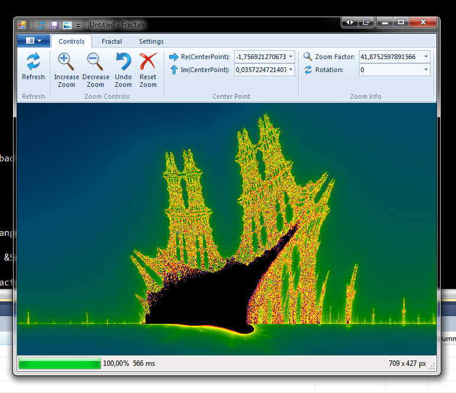
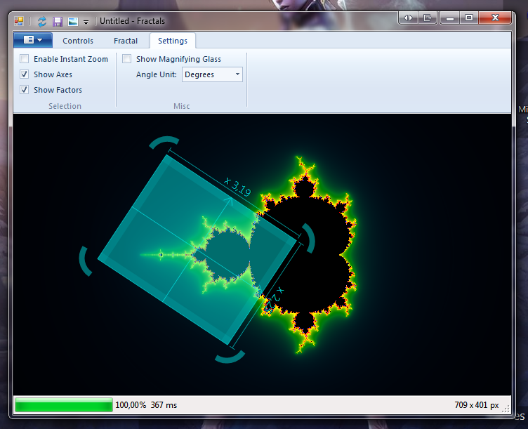
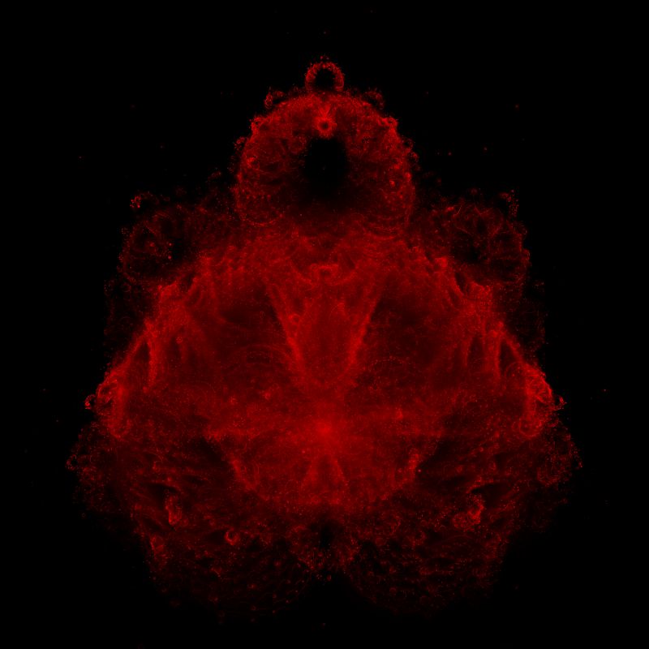

# Fractals

Tool to create funny looking images of Fractals, using .Net Framework 4.0 and OpenCL.

Screenshots of the GUI:

Example Exported Fractal (a variant of the Mandelbrot set called "Buddhabrot"):

